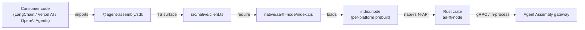

# Architecture

`@agent-assembly/sdk` is a TypeScript surface over the Agent Assembly Rust runtime. It
intentionally separates three concerns: the **native FFI layer** (Rust → JavaScript via
napi-rs), the **framework adapter layer** (LangChain, OpenAI Agents, Vercel AI SDK), and
the **packaging layer** (dual ESM / CJS module outputs). This page walks each one in turn.

## napi-rs FFI layer

The `aa-ffi-node` crate at `native/aa-ffi-node/` is a Rust library compiled by napi-rs
into a per-platform `.node` binary. The TypeScript layer loads that binary at runtime
through `src/native/client.ts` and exposes a thin async surface to the rest of the SDK.

The per-platform binary is shipped as an `optionalDependencies` entry
(`@agent-assembly/linux-x64-gnu`, `darwin-x64`, `darwin-arm64`, `win32-x64-msvc`) and
selected at install time by `scripts/postinstall.mjs` based on `process.platform` and
`process.arch`. Consumers who can't use a prebuilt binary may rebuild via
`pnpm native:build:release` against a local Rust toolchain.
