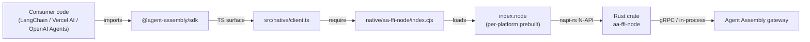
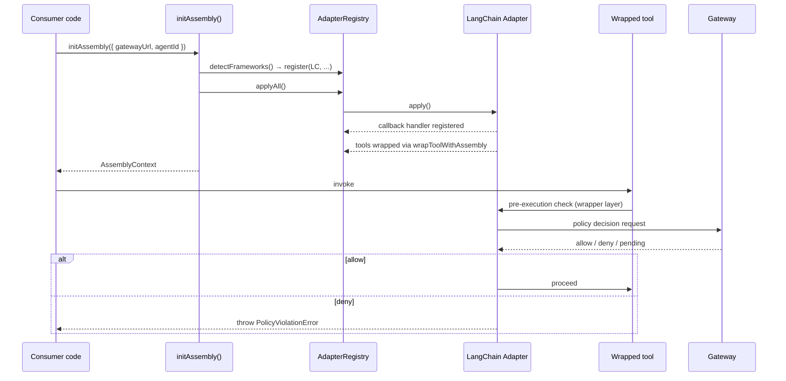
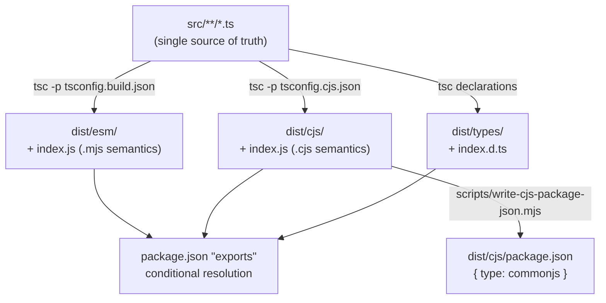

# Architecture

`@agent-assembly/sdk` is a TypeScript surface over the Agent Assembly Rust runtime. It
intentionally separates three concerns: the **native FFI layer** (Rust → JavaScript via
napi-rs), the **framework adapter layer** (LangChain, OpenAI Agents, Vercel AI SDK), and
the **packaging layer** (dual ESM / CJS module outputs). This page walks each one in turn.

## napi-rs FFI layer

The `aa-ffi-node` crate at `native/aa-ffi-node/` is a Rust library compiled by napi-rs
into a per-platform `.node` binary. The TypeScript layer loads that binary at runtime
through `src/native/client.ts` and exposes a thin async surface to the rest of the SDK.



The per-platform binary is shipped as an `optionalDependencies` entry
(`@agent-assembly/linux-x64-gnu`, `darwin-x64`, `darwin-arm64`, `win32-x64-msvc`) and
selected at install time by `scripts/postinstall.mjs` based on `process.platform` and
`process.arch`. Consumers who can't use a prebuilt binary may rebuild via
`pnpm native:build:release` against a local Rust toolchain.

## Framework adapters and the AdapterRegistry

Every supported third-party framework is integrated through an object that satisfies
the `Adapter` interface in `src/adapters/adapter.ts`. Adapters are added to an
`AdapterRegistry` (`src/adapters/adapter-registry.ts`) at `initAssembly()` time, and
`applyAll()` activates each one's framework-specific hooks.



LangChain requires a **two-layer enforcement model** because its `handleToolStart`
callback cannot preempt execution by return value. The adapter therefore registers a
callback handler (post-execution redaction at `handleToolEnd`) **and** auto-wraps tools
with `wrapToolWithAssembly` (true pre-execution deny / pending checks). Both layers
must be kept consistent — changes to one require corresponding changes to the other.

## Dual ESM / CJS package structure

The package publishes both ECMAScript-Modules and CommonJS entries from a single
TypeScript source. Two `tsc` passes drive the build:



The package's `exports` field is the single source of truth for module resolution:

```json
"exports": {
  ".": {
    "import": "./dist/esm/index.js",
    "require": "./dist/cjs/index.js",
    "types": "./dist/types/index.d.ts"
  }
}
```

ESM consumers (`import { ... } from "@agent-assembly/sdk"`) resolve to `dist/esm/`; CJS
consumers (`require("@agent-assembly/sdk")`) resolve to `dist/cjs/`. TypeScript consumers
in either module system find `dist/types/index.d.ts`. The CJS sub-tree's own
`package.json` (written by `scripts/write-cjs-package-json.mjs`) declares
`{ "type": "commonjs" }` so Node treats `.js` files there with CJS semantics regardless
of the parent `package.json`'s `"type": "module"`.
